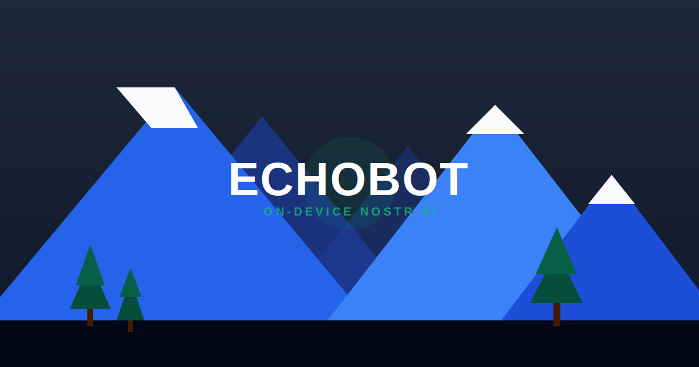

# EchoBot 🤖 v0.2.0

EchoBot is an intelligent, privacy-focused, on-device AI assistant for the **Nostr** protocol. It allows you to monitor network activity and engage with users using fully customizable AI identities—all running locally in your browser.



## ✨ v0.2.0: The Swarm Update

The 0.2.0 release introduces the highly anticipated **Multi-Bot Orchestrator**, allowing you to run multiple independent bot identities simultaneously from a single browser tab.

### 🌟 New in v0.2.0

- **Multi-Bot Simultaneous Architecture**: Background your bots! You can now toggle multiple identities to "Live" mode. Each bot maintains its own independent Nostr subscription and target monitoring while sharing a single, efficient AI engine.
- **Unified Logging Dashboard**: The Timeline now tracks your entire swarm. All logs (replies, reactions, target notes) are prefixed with the bot's name, making background activity easy to monitor at a glance.
- **Performance Optimization**: Deep cryptographic operations (npub encoding/decoding) are now memoized and pre-calculated, significantly reducing CPU load when viewing and managing large identity lists.
- **Improved UI/UX**: Distinct "Focused" vs "Live" states for bots. Configure one bot while others work in the background. Added "Stop All" functionality for instant swarm management.

### 🌟 Core Features

- **On-Device LLMs**: Powered by Transformers.js, running models like **Gemma 3 270M**, **SmolLM2 360M**, and **Llama 3.2 1B** directly in your browser. No API keys required.
- **Identity Marketplace**: Discover community-published personas or share your own using the **Kind 38752** event type.
- **Cloud Sync**: Optional anonymous backup of your bot identities to the Nostr network, allowing you to restore your swarm on any device.
- **Smart Onboarding**: A hardware-aware setup wizard that recommends the best AI model for your device's CPU and RAM.
- **Performance Optimized**: Leverages **SharedArrayBuffer** and multi-threading, automatically scaling up to 8 CPU cores for lightning-fast inference.
- **Privacy First**: Your keys, bot configurations, and conversation histories never leave your local browser storage.

## 🚀 Getting Started

### Prerequisites

- [Node.js](https://nodejs.org/) (v18+)
- [npm](https://www.npmjs.com/)
- A modern browser with **SharedArrayBuffer** support (Chrome, Edge, Firefox).

### Installation

1. Clone the repository:
   ```bash
   git clone https://github.com/hardran3/EchoBot.git
   cd EchoBot
   ```

2. Install dependencies:
   ```bash
   npm install
   ```

3. Run in development mode:
   ```bash
   npm run dev
   ```

## 🛠️ Management & Tuning

### Bot Swarm Management
Access **Bot Central** via the "Manage Bots" button in the header.
- **My Identities**: Toggle bots to "Live" to start background automation. Click the settings icon to bring a bot into focus for configuration.
- **Marketplace**: Browse personas published by other curators or publish your own unique character to the network.

### AI Persona Tuning
The **Persona** dashboard provides granular control over your bot's "soul":
- **System Prompt**: Define the character's name, vibe, and goals.
- **Advanced Tuning**: Hover over Temperature, Top-P, and Penalty sliders for tooltips explaining how each affects the AI's creativity and focus.

### Danger Zone
If you need a clean slate, use the **Fresh Start** button in the General settings tab to clear all local cache, identities, and logs.

## 📜 Protocol Details

EchoBot uses specialized Nostr event kinds for its marketplace features:
- **Kind 38752**: AI Persona Definition (contains sanitized JSON configuration).
- **Kind 5**: Deletion requests for unpublishing personas.

## ⚖️ License

MIT

---
*Built with React, TypeScript, Vite, and Hugging Face Transformers.js.*
